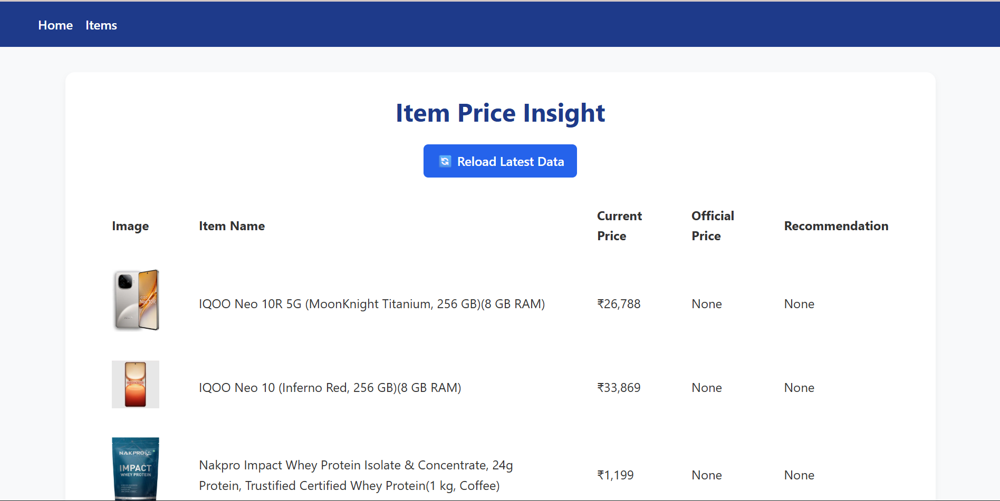
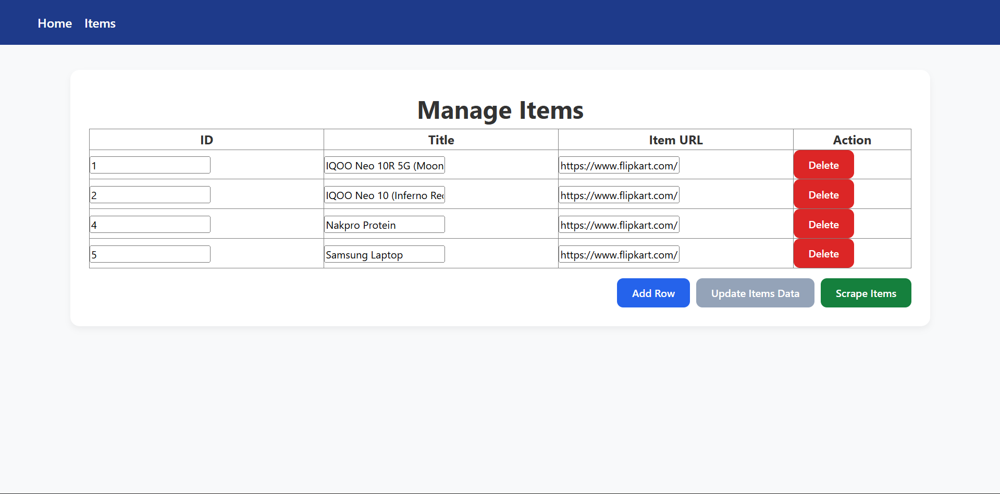

# 🛒 Item Price Insight App

**Version 1.0 (Active Development 🚀)**

The **Item Price Insight App** is a Flask-based web application designed to help users track, scrape, and analyze product prices from e-commerce platforms.  
It provides a central dashboard to manage items, scrape latest prices, and gain insights on price recommendations.

---

## ✨ Features

- **Items Management**  
  - Add, edit, and remove items from `items.json`.  
  - Items are stored as an **array of objects** (e.g., `[{"id": 1, "title": "..."}]`).  

- **Web Scraping**  
  - Scrape current prices of listed items directly from the UI.  
  - Updates the stored `items.json` file with the latest data.  

- **Insights Dashboard**  
  - Home page (`/home`) shows a live comparison table:  
    - 📸 Image  
    - 📝 Item Name  
    - 💰 Current (scraped) Price  
    - 🏷️ Official Price  
    - ✅ Recommendation  

- **Reload Data Button**  
  - Refreshes cached data without restarting the app.  
  - Always shows the **latest scraped data** on the home page.  

- **Modern UI/UX**  
  - Clean, table-based layout.  
  - Styled with custom CSS for clarity.  

---

## 🛠️ Installation

### 1. Clone the Repository
```bash
git clone https://github.com/your-username/item-price-insight.git
cd item-price-insight
````

### 2. Create Virtual Environment

```bash
python -m venv venv
source venv/bin/activate   # On Linux/Mac
venv\Scripts\activate      # On Windows
```

### 3. Install Dependencies

```bash
pip install -r requirements.txt
```

### 4. Run the App

```bash
flask run
```

By default, the app runs on:
👉 [http://127.0.0.1:5000](http://127.0.0.1:5000)

---

## 📂 Project Structure

```
item-price-insight/
│── app.py                 # Flask entry point
│── home.py                # Home blueprint (dashboard & reload logic)
│── items.py               # Items management & scraping
│── utils/
│    └── data_loader.py    # Helper to load latest data
│── templates/
│    ├── base.html
│    ├── home.html
│    └── items.html
│── static/
│    └── css/
│         ├── home.css
│         └── items.css
│── items.json             # Stores items as array of objects
│── requirements.txt
└── README.md
```

---

## 📸 Screenshots

### 🔹 Home Page (Dashboard)

* Displays all items in a comparison table.
* Shows scraped prices, official prices, and recommendation.


---

### 🔹 Items Page

* Add, edit, or delete items.
* Items are updated in `items.json` automatically.

---

## 🚧 Development Notes

* The app is in **active development**.
* Current version: **1.0**
* Features like advanced scraping, analytics, and item grouping will be introduced in upcoming releases.

---

## 🤝 Contributing

Contributions, issues, and feature requests are welcome!
Feel free to fork the repo and submit a PR.

---

## 📜 License

This project is licensed under the **MIT License**.

```

---
